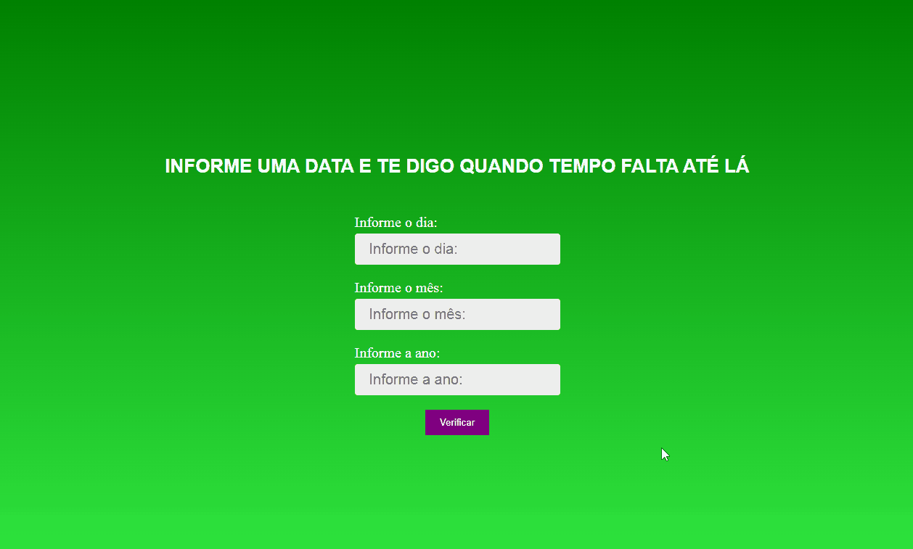

# Cronometro até a data informada.

Foi tão legal poder fazer esta aplicação to tão feliz pois consegui utilizar o paradigma de orientação a objetos neste projeto, e nossa o reaproveitamento de código é fascinante,
implementei a função de que quando os Segundos ficam apenas com um digito exemplo: 5, fiz com que fique com 05, utilizando o método SLICE do Array, a lógica de programação é muito bacana.

## Tecnologia utilizada:
- HTML
- CSS
- JAVASCRIPT

Feito com muito ❤️ por Brandon Carlos

